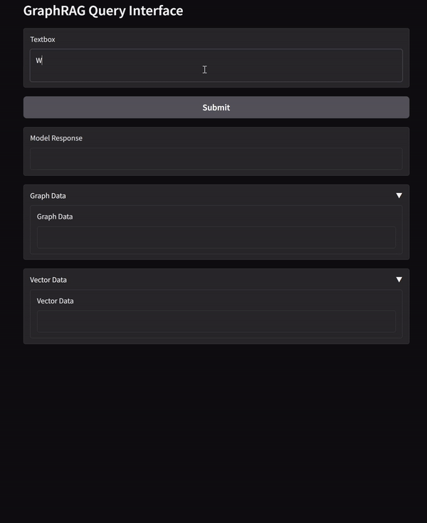

# Hybrid-GraphRAG

# Hybrid RAG Implementation

This repository contains an implementation of a Hybrid Retrieval-Augmented Generation (RAG) model that combines Knowledge Graph-based retrieval with traditional document-based RAG.

## Features

- **Hybrid Retrieval**: Combines graph-based and vector-based retrieval for improved accuracy.
- **Knowledge Graph RAG**: Utilizes Neo4j for structured data retrieval.
- **Naive RAG**: Implements traditional document-based retrieval.
- **LangChain Integration**: Facilitates seamless interaction between components.
- **Local LLM Support**: Integrates Ollama for on-device language model inference.
- **Gradio UI**: Provides a user-friendly web interface for model interaction.

## User Interface
